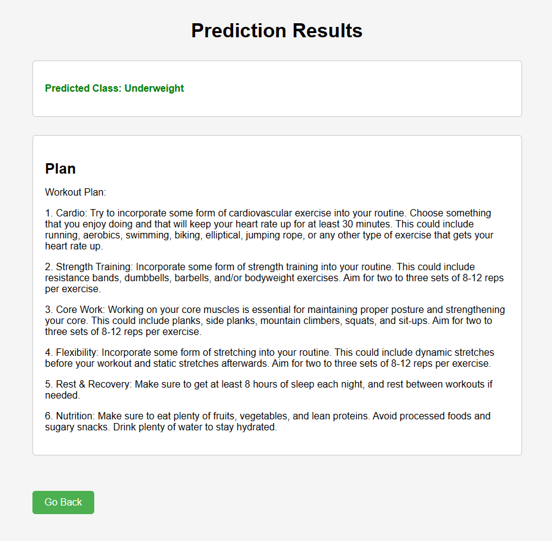
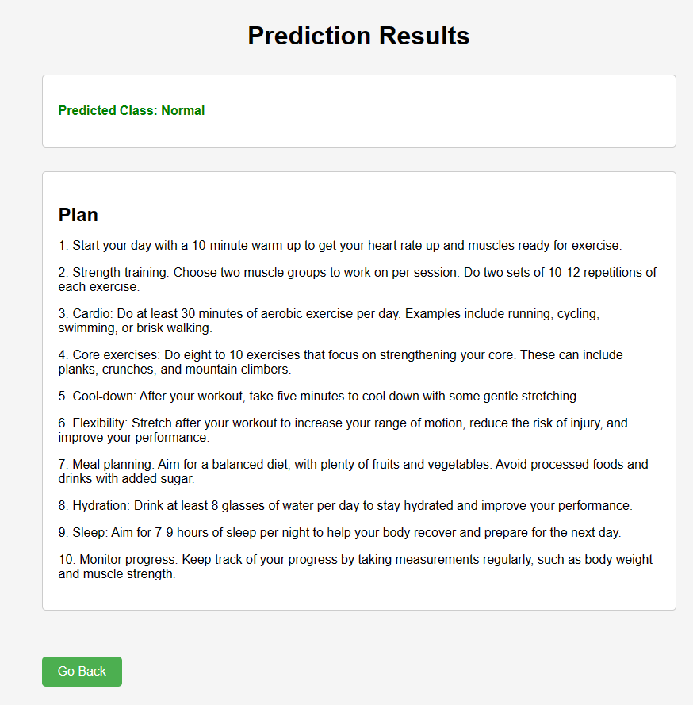
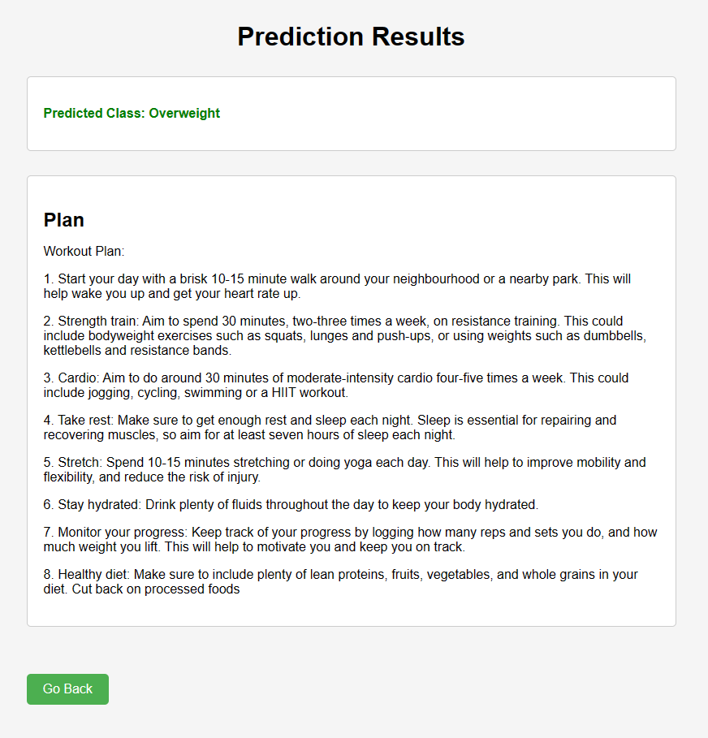

# Fitness Genie:

This workout plan recommendation system is designed to recommend exercises to people based on their details. The system takes in the user'sphysical details as input and calculates their fitness level. Based on these metrics, the system recommends a workout plan that are suitable for their body type and fitness level.

## Getting Started

To use this system, you will need to have Python 3 installed on your computer.

To run the Fitness Genie app local environment, use the following commands:

```
git clone https://github.com/xxshubhamxx/gfg-hacakthon-code-for-india
```

```
pip install -r requirements.txt
```

```
python3 main.py
```

## Usage

When you run the system, you will be prompted to enter your required detials. Once you have entered your detials, the machine learning model would determine if you belong to Normal, Underweight or Overwieght category and recommend a Workout plab that are suitable for your body type and fitness level.

## Contributing

If you find any bugs or have any suggestions for improving the system, please feel free to contribute to the project. You can do this by submitting a pull request or opening an issue on the project's GitHub page.

## Results








## License

This project is licensed under the MIT License - see the [LICENSE](./LICENSE) file for details.
